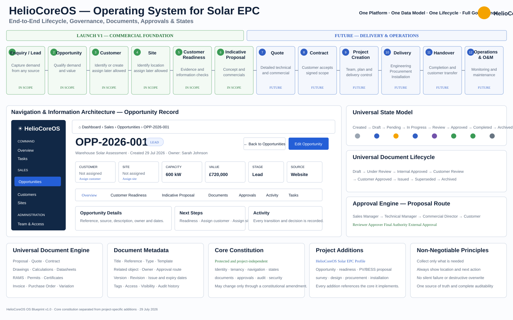

# HelioCoreOS

A portfolio-grade Solar EPC operating system connecting commercial intake, governed documents, approvals, delivery workflows, commissioning, handover, and operations.

## Project governance

HelioCoreOS is governed by the [HelioCoreOS Constitution](./docs/CONSTITUTION.md), the [Solar EPC Launch Scope](./docs/LAUNCH-SCOPE.md), and the [UI Component Strategy](./docs/UI-COMPONENT-STRATEGY.md).

The constitution is the protected core. It defines the rules that every project addition must inherit, including:

- product scope and change control;
- navigation and page context;
- universal object states;
- document generation and revision control;
- approval routes and audit history;
- architecture, tenancy, and security;
- interface and visual decisions;
- diagnostic, testing, and deployment gates.

Solar EPC capabilities are implemented as project additions. They may extend the core but must not silently redefine or bypass it.



## Stack

- Next.js App Router
- TypeScript
- Tailwind CSS
- selective shadcn/ui primitives
- Supabase Auth, PostgreSQL, Storage, and Row Level Security
- Vercel
- GitHub
- planned Python + FastAPI engineering service for HelioCalc
- SketchUp + Skelion + SketchUp LayOut as the supported external physical drawing-authoring stack

## UI architecture

Tailwind CSS remains the styling foundation. shadcn/ui is adopted selectively for accessible interaction primitives such as dialogs, drawers, menus, popovers, comboboxes, date controls, tabs, notifications, skeletons and progress indicators.

The workspace shell, navigation, record hierarchy, lifecycle controls, operational cards, workflow gates, audit surfaces and Solar EPC workspaces remain custom HelioCoreOS components. The UI library must not determine the product identity or weaken governance visibility.

The visual language remains:

`Apple-like simplicity + The Ordinary-like clarity + enterprise governance + Solar EPC precision`

## Engineering architecture

HelioCoreOS separates engineering workflow governance from deterministic engineering computation.

- **HelioCoreOS** owns Customer, Site, Opportunity, Survey, Engineering Scenario, approvals, revisions, BOM, procurement and audit history.
- **HelioCalc** is the planned Python calculation authority for equipment-data-backed Solar PV, BESS and electrical calculations.

The governing architecture is documented in [HelioCalc Engineering Engine](./docs/HELIOCALC-ENGINE.md).

The target engineering path is:

```text
Approved Site Survey
→ Engineering Scenario
→ Equipment Selection
→ HelioCalc Calculation
→ Engineering Findings
→ Physical Drawing Authoring / Engineering Outputs
→ Design Review
→ Approved Design Revision
→ BOM
→ Procurement
```

Manufacturer datasheets and structured technical-data revisions are intended to become engineering source data rather than decorative file attachments. Calculated values such as array capacity, string voltage, MPPT compatibility, DC/AC ratio, cable sizing, BESS sizing and time-series performance should move into the Python engine as each domain becomes authoritative.

The repository reserves [`services/heliocalc`](./services/heliocalc/README.md) for this service boundary.

## Drawing authoring architecture

HelioCoreOS does not attempt to become a CAD or 3D modelling product.

The supported external physical drawing-authoring stack is:

```text
SketchUp        → site / roof / structure / physical 3D model
Skelion         → Solar PV layout authoring assistance
SketchUp LayOut → controlled drawing-sheet production
```

The governing integration is documented in [Drawing Authoring Integration](./docs/DRAWING-AUTHORING-INTEGRATION.md).

The product boundary is deliberate:

- **HelioCoreOS** owns the Drawing Job, Project/Scenario context, revision lifecycle, review, approval, issue and audit history;
- **HelioCalc** owns engineering calculation truth and design guardrails;
- **SketchUp + Skelion** own the physical model and module layout geometry;
- **LayOut** produces controlled drawing sheets and export files;
- **Document Suite** governs published drawing revisions and issued outputs.

`Drawings` is an Engineering sub-workspace, not a global sidebar module.

The first implementation uses controlled file handoff: HelioCoreOS prepares a Drawing Job, the engineer authors externally in SketchUp, and source `.skp` plus PDF/DWG/DXF outputs are published back as governed revisions. A later SketchUp Connector may provide `Create New Model`, `Open Drawing Job`, `Pull Engineering Basis` and `Publish Revision` directly inside SketchUp.

A published drawing must be reconciled against the Engineering Scenario. A mismatch in module count, equipment identity or derived capacity creates an explicit Engineering Finding rather than silently changing the approved Scenario.

Physical drawings remain external-authoring work. Structured electrical outputs such as string schedules, cable schedules, protection schedules, calculation reports, BOMs and eventually governed SLDs should be generated by HelioCoreOS/HelioCalc where the underlying engineering data is authoritative.

## Document Suite architecture

HelioCoreOS treats documents as governed business objects rather than unmanaged file attachments.

The governing architecture is documented in [Document Suite Architecture](./docs/DOCUMENT-SUITE-ARCHITECTURE.md).

The product uses a dual-context document model:

- **workflow context** — documents are created, reviewed, approved and used inside the Opportunity, Project, Engineering, Procurement, Installation, Commissioning or Handover workflow that owns them;
- **Documents Registry** — the global Documents module provides cross-record search, revision control, issue status, expiry monitoring, audit and controlled retrieval without duplicating the underlying workflow.

The target document lifecycle is:

```text
Draft
→ Review
→ Changes Requested
→ Revised Draft
→ Approved
→ Issued
→ Superseded
→ Archived
```

`Approved` and `Issued` are deliberately separate states. Approved or issued revisions are immutable; later corrections create a new governed revision rather than overwriting history.

The existing `documents` table and basic `draft / in_review / approved / superseded` states remain the launch spine until a dedicated Document Suite schema migration is designed and tested.

## Local setup

1. Copy `.env.example` to `.env.local`.
2. Add the Project URL and Publishable Key from the Supabase **Connect** dialog.
3. Run `npm install`.
4. Run `npm run dev`.

## Database

The schema is stored in `supabase/migrations`. Apply migrations with the Supabase CLI or the Supabase SQL editor.

All schema changes must be represented by ordered migration files and must comply with the Constitution and the Solar EPC project profile.

Never commit `.env.local` or any service-role key, secret, database password, or private connection credential.

## Current delivery stage

**Launch Foundation — Commercial Intake and Governance Diagnostic**

### Implemented

- authenticated, tenant-isolated workspace;
- organisation, profile, role, team, and subscription foundation;
- dashboard shell and responsive primary navigation;
- customer and site registers;
- opportunity register and opportunity creation;
- optional customer and site assignment during opportunity intake;
- customer readiness checklist and readiness scoring;
- governed indicative proposal lifecycle and issue gates;
- activity logging for key commercial actions;
- protected Constitution, launch scope, project-extension rules and UI component strategy;
- initial operating-system blueprint covering navigation, states, documents, approvals, and auditability.

### Current diagnostic sprint

The current sprint is validating and strengthening the implemented commercial workflow, with priority given to:

- route and page inventory;
- breadcrumbs and visible location context on every page;
- reliable back and parent navigation;
- contextual page actions;
- loading, empty, error, and not-found states;
- prevention of silent and partial workflow failures;
- database and UI state consistency;
- selective component standardisation without a generic dashboard appearance;
- lint, typecheck, build, and end-to-end workflow gates.

### Launch V1 scope

The required launch path is:

`Enquiry / Lead → Opportunity → Customer assignment → Site assignment → Customer Readiness → Indicative Proposal`

Customer and Site may be assigned after the Opportunity is created. They are not mandatory upfront, but both are required before an indicative proposal can be issued.

### Planned after the launch foundation is proven

- structured survey;
- detailed quotation;
- contract acceptance;
- project conversion;
- Document Suite registry and revision foundation;
- governed document templates and data-bound generation;
- document review, Changes Requested, approval, issue and supersession workflows;
- configurable approval routes;
- HelioCalc equipment-data and datasheet foundation;
- Python Solar PV electrical calculation core;
- BESS sizing and time-series simulation;
- governed engineering scenario comparison and design approval;
- Drawing Workspace and governed Drawing Job model;
- SketchUp/Skelion/LayOut controlled authoring handoff;
- engineering-to-drawing reconciliation and mismatch findings;
- optional HelioCoreOS SketchUp Connector after the manual handoff workflow is proven;
- approved-design-driven BOM generation;
- procurement, installation, quality, and commissioning control;
- governed commissioning and handover document packs;
- operations and maintenance.

These remain project additions and must reference the protected core rather than modifying it implicitly.
